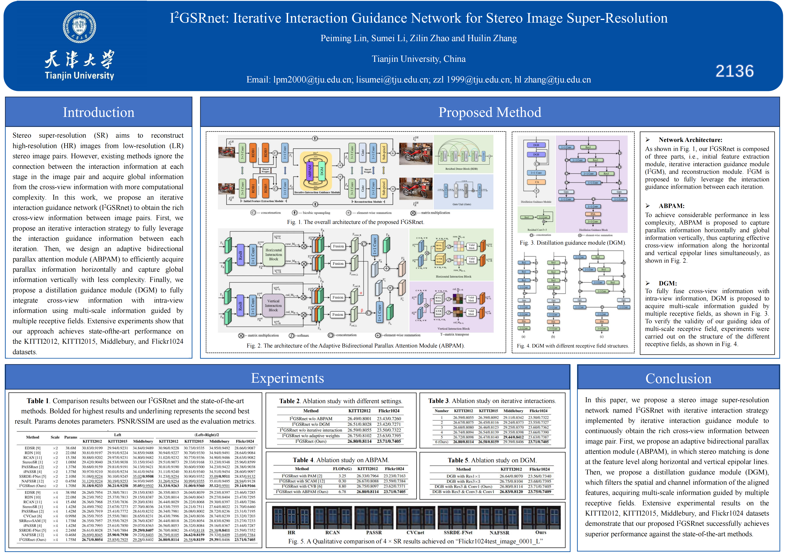
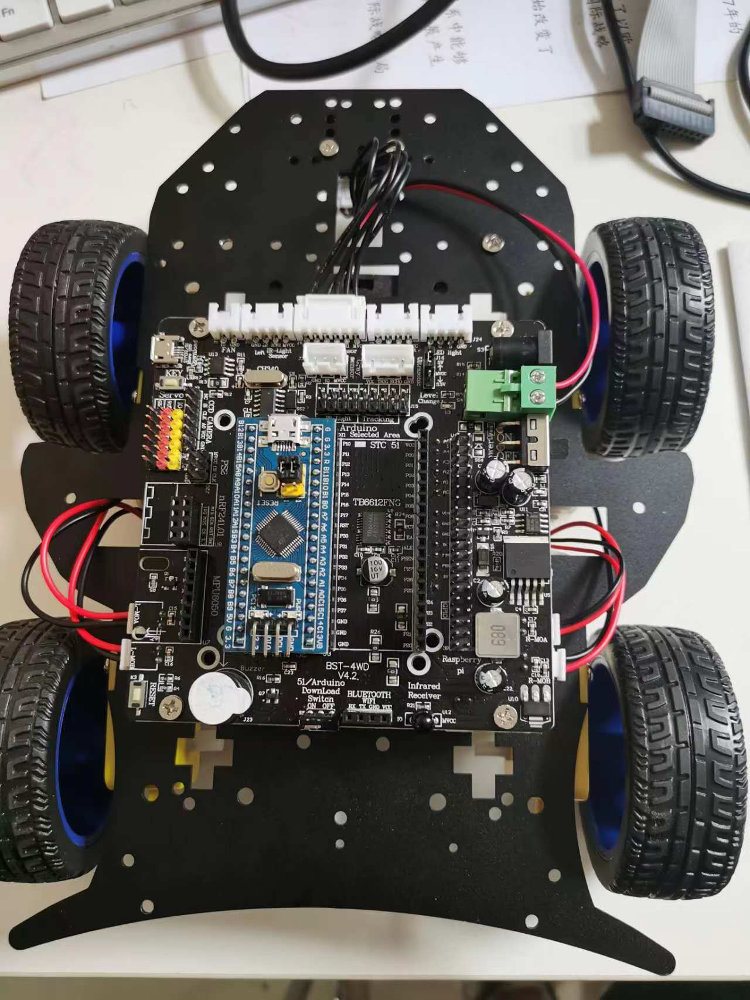
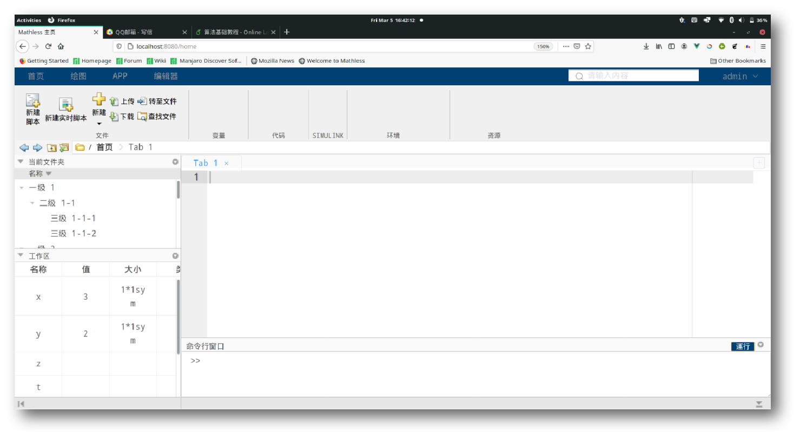
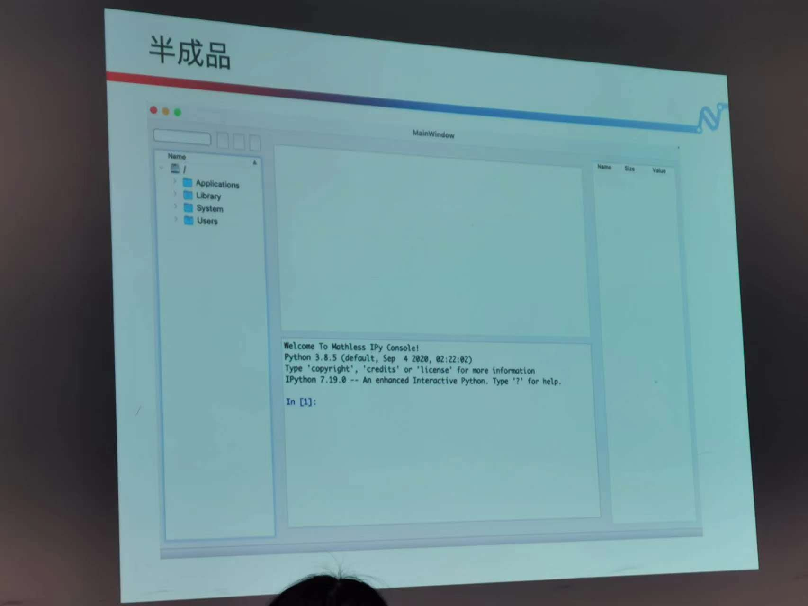
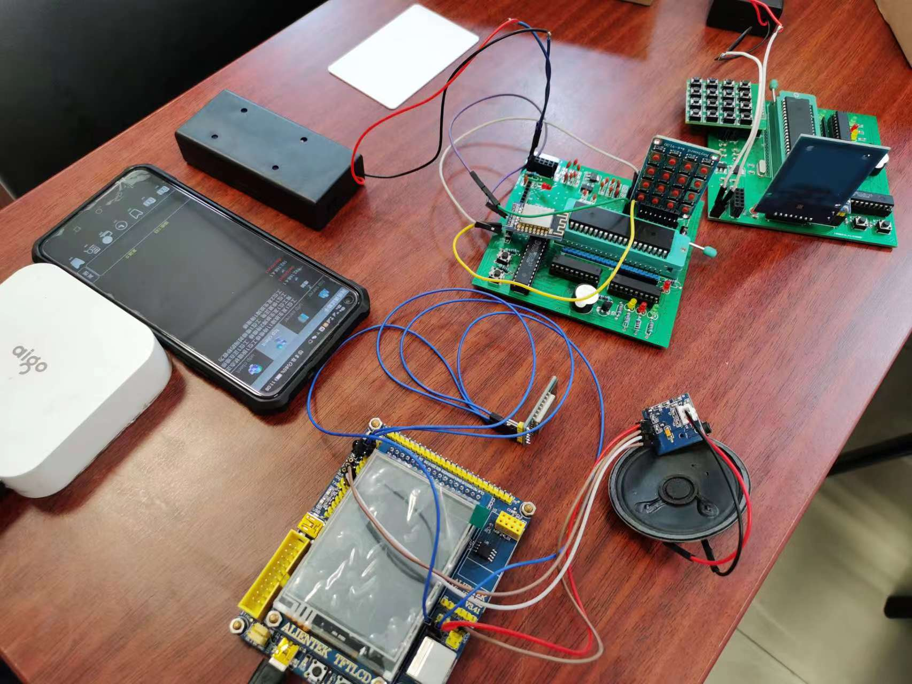
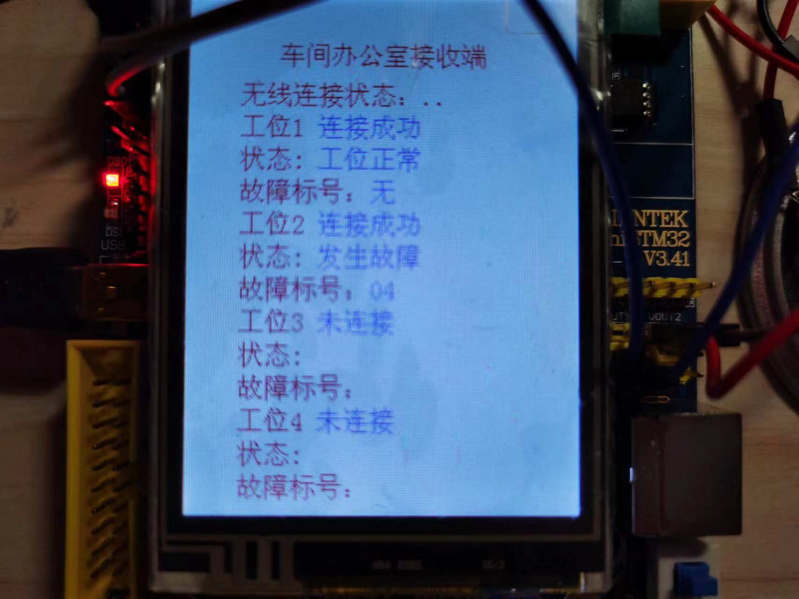
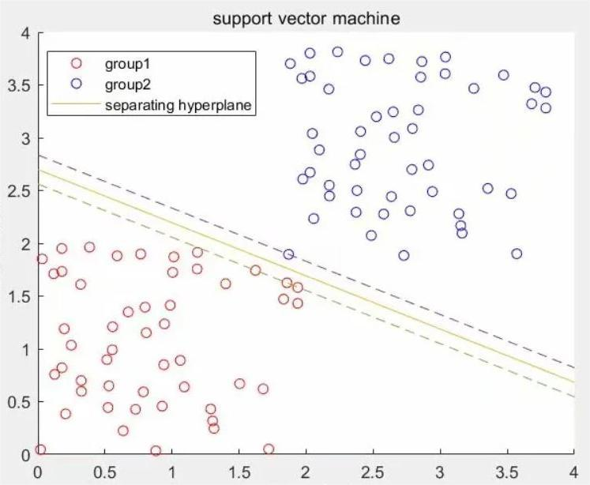
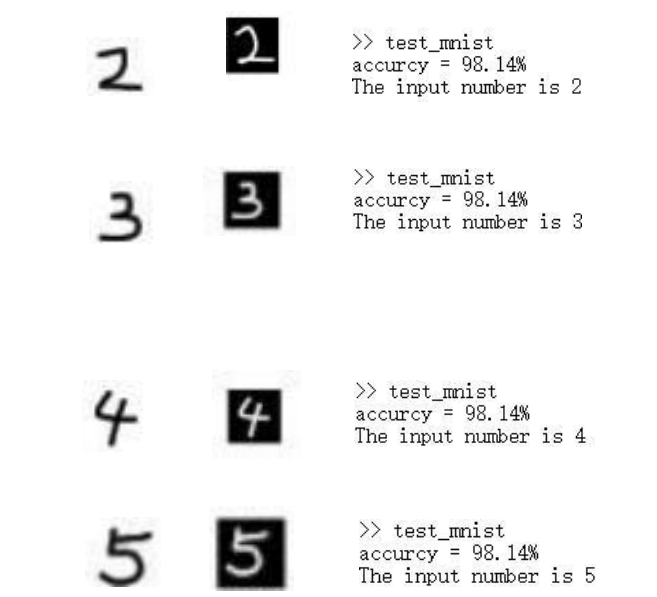
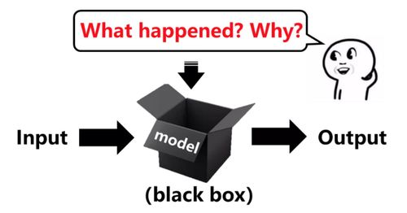
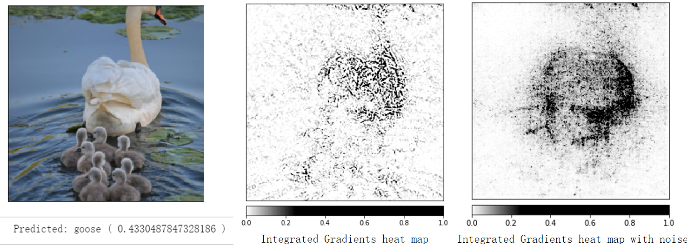

# 个人项目经历
## 🔎 硕士 🔥🔥🔥
📢 进入实验室后主要研究方向为**基于深度学习的图像超分辨率（SR）**，所以对**low-level vision**任务较为熟悉，如图像超分、图像恢复、图像增强等，实验室其他方向包括图像质量评价，文本检测，语义分割等，所以对这些方向也有所了解~
### 2023.03-2023.06 🚀 **I&sup2;GSRnet: Iterative Interaction Guidance Network for Stereo Image Super-Resolution**
- 立体（双目视觉）图像超分，搭建了一个基于迭代交互指导的网络，校准视差信息并捕捉立体图像间的全局信息，并通过多次迭代将跨视点信息与自身视点信息进行融合及校正，效果为同时期SOTA水准。该论文已于**ICME2024**（IEEE International Conference on Multimedia and Expo, CCF-B类会议）发表；
  
### 2023.06-2023.09 🚀 **A Lightweight CNN and Spatial-Channel Transformer Hybrid Network for Image Super-Resolution**
- 单图轻量化超分，搭建了一个CNN和Transformer混合的轻量型网络，其中融合了Transformer提取到的通道和空间双维度全局特征以及CNN提取到的高频局部特征，以极少的参数量和计算量实现了极佳的性能，效果为同时期SOTA水准。该论文已于**ICME2024**（IEEE International Conference on Multimedia and Expo, CCF-B类会议）发表（**oral**）；
  
### 2023.12-2024.01 🚀 **Hybrid CNN and Transformer Network Guided by Quality Assessment for Depth Map Super-Resolution**
- 质量评价指导的深度图超分，效果为同时期SOTA水准；
  
  
### 2023.09-2024.03 🚀 **Toward Blind Super-Resolution for Stereo Image：A Hybrid Degradation-Content aware Stereo Image Super-Resolution Network**
- 立体（双目视觉）图像盲超分，首次面向立体图像盲超分领域，利用无监督对比学习提取退化和内容表征作为先验信息并指导网络进行重建，效果远超现有单图盲超分和立体超分方法，对真实世界中各种复杂退化具有鲁棒性；
#### 📷 SR Results（点击图片查看）
  
  
### 2024.03-2024.07 🚀 **Degradation Intensity Modulation Transformer for Real-World Stereo Image Super-Resolution**
- 立体（双目视觉）图像真实世界超分，包括PSNR版本和GAN版本，客观指标及主观视觉效果远超现有单图盲超分和立体超分方法，且足够轻量化，更适用于真实场景；
#### 📷 SR Results（点击图片查看）
   
   
## 🔎 本科 🔥🔥
### 大三
- 📢当时由于参加电子设计竞赛，学过一些相关知识（控制类偏多），比如基于arduino的智能小车，基于openmv的舵机云台，还有电赛经典题目滚球控制系统、电磁炮、球形机器人等：
  - 📷小车具有基本功能如行走、循迹、测距、避障等；openmv具有机器视觉算法如色块跟踪、人脸检测等，可对实际场景中的物体进行自动检测和识别，并控制舵机云台跟随其运动。

    
- 📢也参与了学校的一些科研项目，比如加入智算学部实验室帮忙参与Mathless（类似于国产自研matlab）的开发：
  - 📷负责一些通信算法及模型的开发

    
- 📢也参与过校企合作的项目（光华电子&天大），设计云端互联工位故障报警系统：
  - 📷偏嵌入式，基于51和stm32单片机的信号传输系统，并加备了云端和联网等功能

    
### 大四
- 📢开始接触有关机器学习以及深度学习的知识，比如K-means、BP、SVM、手写体识别等：
  - 📷学习内容主要为学校的深度学习课程以及斯坦福CS231N课程（包括大作业等）

     
- 📢毕设是做的图像分类以及神经网络的可解释性相关：
  - 📷backbone用的ResNet，可解释性方法为积分梯度归因法等

    
